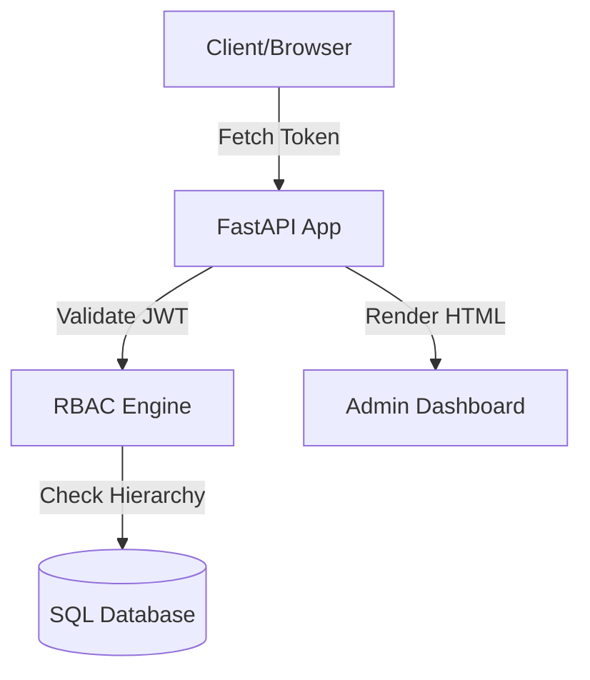

# 🏗️ Architecture

Understanding the internal design of **FastAPIOAuthRBAC** helps in making informed decisions about security and performance.

## 🧱 Component Overview

## 🔐 Authentication Flow

1.  **Login**: User provides credentials or logs in via OAuth.
2.  **Token Issuance**: The server generates a signed JWT.
3.  **Stateful Revocation**: If `AUTH_REVOCATION_ENABLED` is `true`, a version/counter is stored in the database. When a user logs out "Globally", this counter increments, instantly invalidating all existing JWTs for that user.

## 🛡️ RBAC Evaluation Logic

When a permission check occurs:
1.  Retrieve the user's direct roles.
2.  Iterate through each role and its ancestors (recursive hierarchy).
3.  Collect all permissions associated with this set of roles.
4.  Verify if the requested permission(s) exist in the collected set.

## 💾 Database Schema

The library manages three main tables (plus association tables):
- `users`: Stores email, hash, active status, and revocation status.
- `roles`: Stores role names and parent relationships.
- `permissions`: Stores unique permission strings.

---
[🏠 Index](README.md) | [📖 API Reference](api-reference.md)
